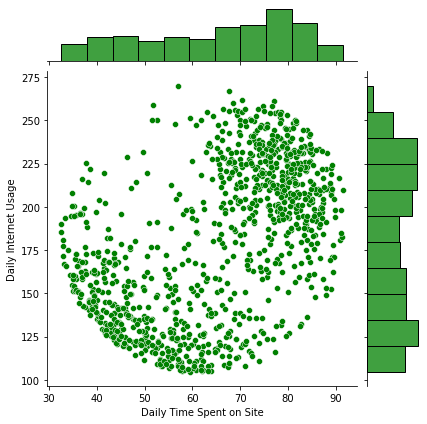

#  Marketing analysis with a logistic regression model
Using historical data to create a logistic regression model to find insights about a categorical value.

This dataset contains information about a group of individuals who either clicked or didnt clik specific Ads.

## The dataset
The dataset (csv document in this folders) includes the following numerical values:
- 'Daily Time Spent on Site' in minutes
- 'Age' in years
- 'Area Income' in dollars
- 'Daily Internet Usage' in minutes
- 'Ad Topic Line'
- 'City'
- 'Male' as a boolean for gender
- 'Country'
- 'Timestamp'

The target variable is 'Clicked on Ad'

I'm using pandas to read the dataset as a dataframe.

## Exploratory analysis

I'm using seaborn to conduct my exploratory data analysis.

Histogram of users who clicked on Ad based on their age:

I'll also take a look at Area Income versus Age of the users:

Daily Spent on Site per Age group:

Daily Spent on Site per Daily Internet Usage:

## Training and Testing Data

I've removed all non-categorical data (such as City, Ad Topic, etc.).
I'm using the [train-test-split from SciKitLearn](https://scikit-learn.org/stable/modules/generated/sklearn.model_selection.train_test_split.html) method to create 2 subsets:
- X array: Contains the features to train on
- y array: Contains the target variable (Clicked on Ad)

The model will be trained with the X array, which we'll compare to the y array to evaluate the model at the end.

To train the model, I've used the LogisticRegression() method from the SciKitLearn library.

## Predictions

I've used the in-built predict() method from SciKitLearn to run the predictions.

## Evaluating the Model

In order to evaluate the model, I've calculated the following model erros:

Which show an accuracy of about 91%

## Conclusion
This model can be used to predict the likelihood of an Ad click with an accuracy of 91% based on the aforementioned numerical variables.

## Libraries Used

| Name | Library |
| ------ | ------ |
| Pandas | https://pandas.pydata.org/ |
| Matplotlib | https://matplotlib.org/ |
| Seaborn | https://seaborn.pydata.org/ |
| SciKitLearn | https://scikit-learn.org/stable/ |